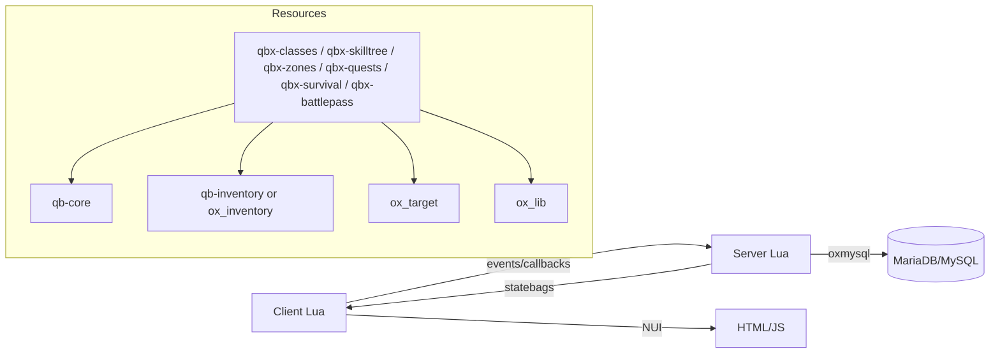

# Arquitetura

## Visão de alto nível

O servidor FiveM roda múltiplos **resources** (pacotes). O **qb-core** fornece o núcleo (jogador, economia básica, eventos). Os sistemas de MMORPG-sobrevivência são **resources adicionais** que consomem o core e uns aos outros de forma controlada (exports, eventos, banco de dados).

## Camadas lógicas

| Camada | Responsabilidade | Onde |
|--------|------------------|------|
| **Shared** | Constantes, tabelas estáticas (IDs, multiplicadores), helpers sem side-effects | `shared/*.lua` |
| **Server** | Autoridade, persistência, validação, loot rolls, XP, combate PvP autorizado | `server/*.lua` |
| **Client** | Input, câmera, desenho, NUI bridge, *predição visual* (não fonte da verdade) | `client/*.lua` |
| **NUI** | UI (React/vanilla), recebe mensagens do client | `html/` |

Fluxo recomendado para uma ação do jogador:

1. Player interage (target / comando / tecla) → **client** pede ao **server** (evento seguro ou callback).
2. **Server** valida e atualiza estado (`metadata`, DB, inventário).
3. **Server** replica o necessário: `TriggerClientEvent`, **state bags**, ou atualização de `PlayerData`.

## qb-core neste repositório

Ficheiros relevantes:

- `server/player.lua` — criação do jogador, `metadata`, `Save()`.
- `server/events.lua` — callbacks, `QBCore:UpdatePlayer` (fome/sede tick).
- `client/loops.lua` — intervalos de sync e efeitos locais (ex.: dano por fome/sede zerada).
- `server/exports.lua` — `AddItem`, `AddJob`, `ExploitBan`, etc.

Novos sistemas **escutam** `QBCore:Server:PlayerLoaded` e persistem no fluxo de `Save`/disconnect.

## Integração entre sistemas

Consulte a matriz em [systems/00-overview.md](systems/00-overview.md). Regra: dependências **explícitas** no `fxmanifest.lua` (`dependency` / `dependencies`) e na documentação.

## State bags vs metadata vs SQL

- **`PlayerData.metadata`** — JSON na linha do jogador; bom para poucos campos acessados com frequência.
- **`Player(source).state`** — replicação runtime (flags como zona segura, sangrando); não substitui persistência se o estado deve sobreviver ao restart.
- **Tabelas SQL** — quest log, nós da skill tree, progresso de passe; consultas e índices sob seu controlo.
