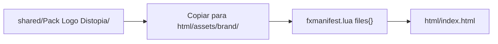

# Identidade visual — Distopia

## Cidade e marca

O servidor opera sob a marca **Distopia**. Referências narrativas à cidade (HUD, menus, notificações temáticas, texto de loading) devem usar esse nome de forma consistente.

**Tom sugerido** (ajustável pelo time de lore): sobrevivência urbana / decadência controlada; os assets oficiais da logo estão na pasta indicada abaixo.

## Paleta oficial

Toda UI nova deve partir desta paleta:

| Uso | Cor |
|-----|-----|
| Texto / luz quente | `#F2D6BD` |
| Acento / botoes primarios | `#8C5230` |
| Paineis / bordas densas | `#401616` |
| Fundo / preto base | `#0D0D0D` |

Variacoes com alpha sao permitidas quando forem derivadas dessas quatro cores.

## Fonte de verdade dos assets

Todos os ficheiros de marca estão em:

**[`shared/Pack Logo Distopia/`](../shared/Pack%20Logo%20Distopia/)**

A pasta contém **espaços no nome**. Ao referenciar em `fxmanifest.lua` ou URLs, usa aspas ou normaliza copiando ficheiros (recomendado na secção seguinte).

### Inventário de ficheiros (referência)

| Tipo | Exemplos no pack |
|------|-------------------|
| PNG estático | 2000×2000, 512×512, 96×96 — variantes: Transparente, Com Efeitos, Apenas Nome, Com Fundo |
| GIF animado | `Distopia - Conectando.gif`, `Distopia - Página.gif`, `GIF - Distopia.gif` |

## Mapeamento recomendado (predefinição)

Ajusta conforme o design final; estes são defaults sensatos para NUI FiveM:

| Uso | Ficheiro sugerido no pack |
|-----|---------------------------|
| **Favicon** (`<link rel="icon">`) | `LOGO Distopia (96x96) (Transparente) (Extra - Com Efeitos) - by Design Ideal.png` |
| **Cabeçalho de menu / header NUI** | `LOGO Distopia (512x512) (Transparente) (Extra - Com Efeitos) - by Design Ideal.png` |
| **Splash / ecrã de carregamento** | `Distopia - Conectando.gif` |
| **Watermark / fundo fullscreen** | `LOGO Distopia (2000x2000) (Transparente) - by Design Ideal.png` |

## Como usar num resource `qbx-*`

### Opção A — Recomendada: copiar e normalizar nomes

1. Copia só os ficheiros necessários para `qbx-<feature>/html/assets/brand/`.
2. Renomeia para nomes **sem espaços**, por exemplo:
   - `logo-96.png`
   - `logo-512.png`
   - `logo-2000.png`
   - `loading.gif`
3. Lista no `fxmanifest.lua`:

```lua
files {
    'html/index.html',
    'html/css/**',
    'html/js/**',
    'html/assets/brand/**',
}
```

4. No HTML, usa caminhos relativos ao `ui_page`, por exemplo:

```html
<link rel="icon" type="image/png" href="assets/brand/logo-96.png" />
<header></header>
```

### Opção B — Referência direta ao qb-core (não recomendado)

URLs do tipo `nui://qb-core/shared/Pack Logo Distopia/...` exigem que esses ficheiros estejam declarados em **`files { }` do `qb-core`** — atualmente o manifest do core **não** expõe esta pasta. Além disso, espaços no caminho tornam os URLs frágeis (`%20`). Preferir sempre a **Opção A**.

## Snippets

### CSS de fundo (watermark)

```css
.splash {
  background-image: url('assets/brand/logo-2000.png');
  background-size: cover;
  background-position: center;
}
```

## Melhoria futura (opcional)

Renomear a pasta para algo como `shared/brand/distopia/` **sem espaços** simplifica ferramentas e manifests. Só fazer com coordenação do time e atualização de referências.

## Fluxo resumido



## Referências cruzadas

- Regra para agentes: [`AGENTS.md`](../AGENTS.md)
- Padrões de código / UI: [03-padroes-de-codigo.md](03-padroes-de-codigo.md)
- Esqueleto NUI: [templates/resource-skeleton/](templates/resource-skeleton/)
